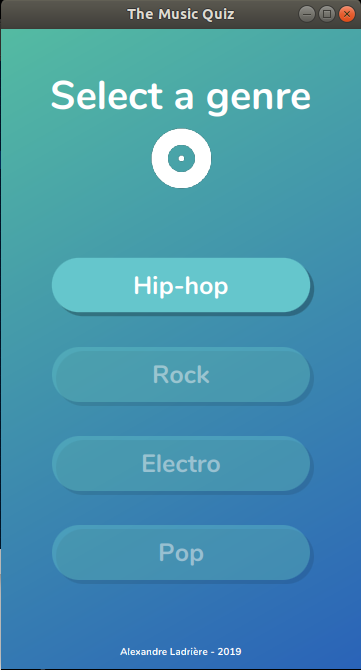
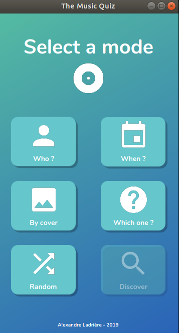

# [JAVA] The Music Quiz

**The Music Quiz** is a simple music quiz game I am currently developing to learn how to program in java and how to use git.

There are different questions types in the quiz, which are all about albums:

  - __Who ?__ - You have to find the author of the album
  - __When ?__ - You have to find when the album was released
  - __Which ?__ - You have to find the name of the album according to the artist name and the released date
  - __By cover__ - You have to find the name of album author and the released date according to the given album cover
  - __Random__ - Randomly asked one of the above questions

In addition to these question types, you have the option __Discover__: question are replaced by information about an album. It is a good way to learn about available albums in the database.


## Database
The database is build from different albums charts you can find on the internet (like on [Rate Your Music]) thanks to a python script. This python script is also scraping information from [Wikipedia], and translating them in english if needed thanks to [Deepl].

## Test (Linux)
First, install the _Nunito_ font pack with the [instal_fonts.sh] file if you don't already have it (it is not mandatory):
```sh
$ sh instal_fonts.sh
```

Then, you need to compile all the files thanks to the [compile.sh] file (WARNING: do not forget to change the classpath for javaFX):
```sh
$ sh compile.sh
```

To run the application, you just have to run the [run.sh] file (WARNING: do not forget to change the classpath for javaFX):
```sh
$ sh run.sh
```

## Demo
 

## Screenshots

             

## Developed with
  - Ubuntu 18.04.2 LTS
  - java 12.0.2 2019-07-16
  - Java(TM) SE Runtime Environment (build 12.0.2+10)
  - Java HotSpot(TM) 64-Bit Server VM (build 12.0.2+10, mixed mode, sharing)

## Todo
  - Enhancing database
  - Adding a multiplayer option
  - Adding _Discover_ mode
  - Adding _Settings_ possibilities
  - Adding adaptative background/buttons color changes according to the cover color

Feel free to add ideas and to contribute :metal:

## License
This project is licensed under the MIT License - see the [LICENSE.md] file for details


   [LICENSE.md]: <LICENSE.md>
   [instal_fonts.sh]: <instal_fonts.sh>
   [compile.sh]: <compile.sh>
   [run.sh]: <run.sh>
   [Rate Your Music]: <https://rateyourmusic.com/>
   [Wikipedia]: <https://www.wikipedia.org/>
   [Deepl]: <https://www.deepl.com/translator>